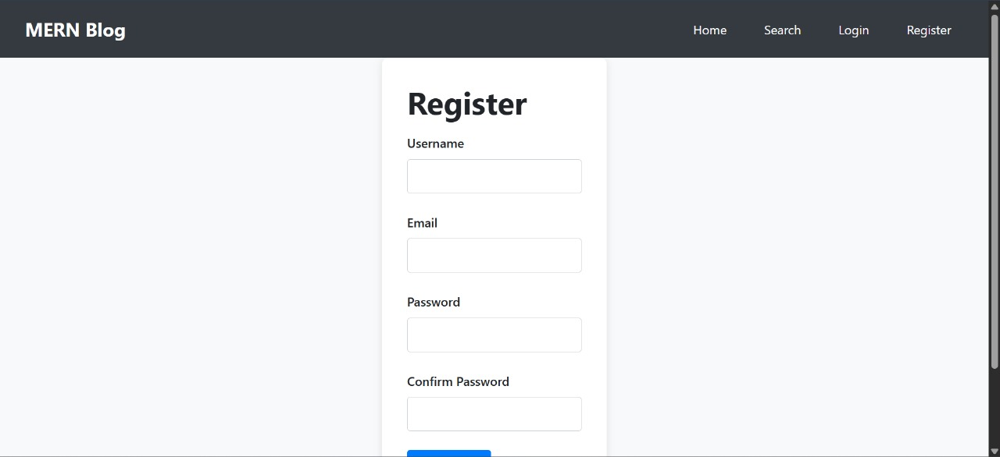
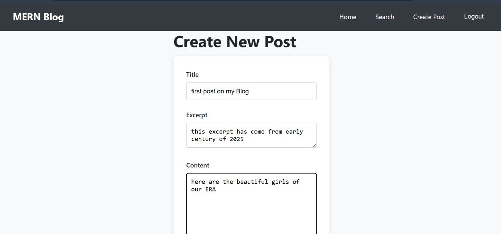
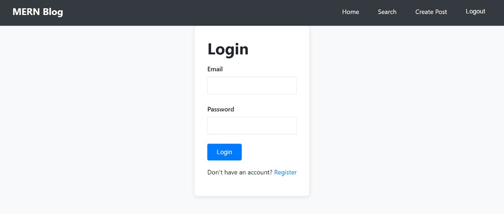
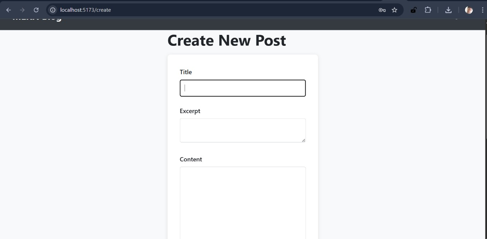
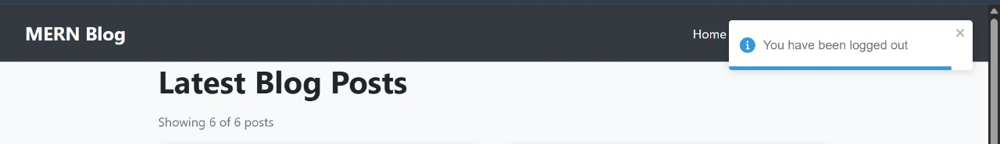

# MERN Stack Blog Application

<div align="center">
  
  
  
  
  
</div>

## 📋 Table of Contents
- [Project Overview](#-project-overview)
- [Features](#-features)
- [Tech Stack](#-tech-stack)
- [Project Structure](#-project-structure)
- [Setup Instructions](#-setup-instructions)
- [API Documentation](#-api-documentation)
- [Features Implemented](#-features-implemented)
- [Screenshots](#-screenshots)
- [Deployment](#-deployment)
- [Contributing](#-contributing)
- [License](#-license)

## 🎯 Project Overview

A comprehensive, full-stack MERN (MongoDB, Express.js, React.js, Node.js) blog application designed for modern content management. This application provides a complete blogging platform with user authentication, post management, categorization, search functionality, and responsive design.

The application features a clean, modern UI built with React and styled with custom CSS, backed by a robust Express.js API with MongoDB for data persistence. It includes JWT-based authentication, role-based access control, and comprehensive CRUD operations for blog posts and categories.

## 🚀 Features

### Core Features
- **🔐 User Authentication**: Secure JWT-based authentication with registration and login
- **📝 Blog Posts Management**: Full CRUD operations for blog posts with rich content
- **🏷️ Category System**: Organize posts by categories with color coding
- **🔍 Advanced Search**: Search posts by title, content, and filter by categories
- **📄 Pagination**: Efficient pagination for large post collections
- **💬 Comments System**: Interactive commenting on posts (framework ready)
- **🖼️ Image Uploads**: Featured image support for posts
- **📱 Responsive Design**: Mobile-first, responsive UI across all devices
- **👑 Admin Features**: Role-based access control for content management

### Technical Features
- **RESTful API**: Well-structured REST API with proper HTTP methods
- **Database Seeding**: Automated database seeding with sample data
- **Input Validation**: Comprehensive server-side and client-side validation
- **Error Handling**: Robust error handling with user-friendly messages
- **Security**: Helmet, CORS, rate limiting, and secure authentication
- **Performance**: Optimized queries with MongoDB indexing and pagination

## 🛠️ Tech Stack

### Backend
- **Runtime**: Node.js (v18+)
- **Framework**: Express.js
- **Database**: MongoDB with Mongoose ODM
- **Authentication**: JSON Web Tokens (JWT)
- **Security**: bcryptjs, helmet, cors, express-rate-limit
- **File Uploads**: Multer
- **Validation**: express-validator
- **Development**: nodemon

### Frontend
- **Library**: React 18 with Hooks
- **Build Tool**: Vite
- **Routing**: React Router v6
- **HTTP Client**: Axios
- **Forms**: React Hook Form
- **Notifications**: React Toastify
- **Styling**: Custom CSS3 with responsive design

### Development Tools
- **Version Control**: Git
- **Package Manager**: npm
- **Environment**: dotenv
- **API Testing**: Postman/cURL

## 📁 Project Structure

```
mern-stack-integration-BOSSY254-LEVI/
├── client/                          # React Frontend
│   ├── public/                      # Static assets
│   ├── src/
│   │   ├── components/              # Reusable UI components
│   │   │   ├── Auth.css            # Authentication styles
│   │   │   ├── CommentForm.jsx     # Comment form component
│   │   │   ├── CommentList.jsx     # Comments display
│   │   │   ├── Loading.jsx         # Loading spinner
│   │   │   ├── Login.jsx           # Login component
│   │   │   ├── Navbar.jsx          # Navigation bar
│   │   │   ├── Pagination.jsx      # Pagination component
│   │   │   ├── PostList.css        # Post list styles
│   │   │   ├── PostList.jsx        # Posts list component
│   │   │   ├── ProtectedRoute.jsx  # Route protection
│   │   │   └── Register.jsx        # Registration component
│   │   ├── context/                # React Context providers
│   │   │   └── AuthContext.jsx     # Authentication context
│   │   ├── hooks/                  # Custom React hooks
│   │   │   ├── useCategories.js    # Categories hook
│   │   │   └── usePost.js          # Posts management hook
│   │   ├── pages/                  # Page components
│   │   │   ├── CreatePost.jsx      # Create post page
│   │   │   ├── EditPost.jsx        # Edit post page
│   │   │   ├── Home.jsx            # Home/dashboard page
│   │   │   ├── Login.jsx           # Login page
│   │   │   ├── PostDetail.jsx      # Post detail page
│   │   │   ├── Register.jsx        # Registration page
│   │   │   └── SearchResults.jsx   # Search results page
│   │   ├── services/               # API service layer
│   │   │   └── api.js              # Axios API configuration
│   │   ├── App.css                 # Global styles
│   │   ├── App.jsx                 # Main app component
│   │   ├── index.css               # Base styles
│   │   └── main.jsx                # App entry point
│   ├── index.html                  # HTML template
│   ├── package.json                # Frontend dependencies
│   └── vite.config.js              # Vite configuration
├── server/                          # Express Backend
│   ├── controllers/                 # Route controllers
│   │   ├── auth.js                 # Authentication controller
│   │   └── posts.js                # Posts controller
│   ├── middleware/                 # Custom middleware
│   │   ├── async.js                # Async error handler
│   │   ├── auth.js                 # Authentication middleware
│   │   ├── errorResponse.js        # Error response utility
│   │   └── validation.js           # Input validation
│   ├── models/                     # Mongoose models
│   │   ├── Category.js             # Category model
│   │   ├── Post.js                 # Post model
│   │   └── User.js                 # User model
│   ├── routes/                     # API routes
│   │   ├── auth.js                 # Authentication routes
│   │   ├── categories.js           # Categories routes
│   │   └── posts.js                # Posts routes
│   ├── utils/                      # Utility functions
│   │   └── sendTokenResponse.js    # JWT token response
│   ├── uploads/                    # File uploads directory
│   ├── .env                        # Environment variables
│   ├── .env.example                # Environment template
│   ├── package.json                # Backend dependencies
│   ├── seed.js                     # Database seeding script
│   └── server.js                   # Main server file
├── .gitignore                      # Git ignore rules
└── README.md                       # Project documentation
```

## 🚀 Setup Instructions

### Prerequisites
- **Node.js** (v18 or higher) - [Download here](https://nodejs.org/)
- **MongoDB** (local installation or MongoDB Atlas account)
- **npm** or **yarn** package manager
- **Git** for version control

### Installation Steps

1. **Clone the Repository**
   ```bash
   git clone https://github.com/PLP-MERN-Stack-Development/react-js-jsx-and-css-mastering-front-end-development-BOSSY254-LEVI.git
   cd mern-stack-integration-BOSSY254-LEVI
   ```

2. **Backend Setup**
   ```bash
   # Navigate to server directory
   cd server

   # Install dependencies
   npm install

   # Copy environment file
   cp .env.example .env

   # Edit .env file with your configuration
   # Required: MONGO_URI, JWT_SECRET
   ```

3. **Frontend Setup**
   ```bash
   # Navigate to client directory
   cd ../client

   # Install dependencies
   npm install

   # The client uses Vite and should work with default settings
   ```

4. **Database Setup**
   - **Local MongoDB**: Ensure MongoDB is running on default port (27017)
   - **MongoDB Atlas**: Create a cluster and update the connection string in `server/.env`

5. **Seed Database (Optional)**
   ```bash
   # From server directory
   node seed.js
   ```
   This creates sample users, categories, and posts for testing.

6. **Start Development Servers**

   **Terminal 1 - Backend:**
   ```bash
   cd server
   npm run dev
   ```
   Server will start on http://localhost:5000

   **Terminal 2 - Frontend:**
   ```bash
   cd client
   npm run dev
   ```
   Client will start on http://localhost:5173

7. **Access the Application**
   - **Frontend**: http://localhost:5173
   - **Backend API**: http://localhost:5000/api

### Environment Configuration

**Server (.env)**
```env
PORT=5000
NODE_ENV=development
MONGO_URI=mongodb://localhost:27017/mern-blog
JWT_SECRET=your-super-secret-jwt-key-change-this-in-production
JWT_EXPIRE=30d
```

**Client (.env)**
```env
# VITE_API_URL=http://localhost:5000/api  # Default works for local development
```

## 📡 API Documentation

### Authentication Endpoints

#### Register User
```http
POST /api/auth/register
Content-Type: application/json

{
  "name": "John Doe",
  "email": "john@example.com",
  "password": "password123"
}
```

**Response:**
```json
{
  "success": true,
  "token": "jwt_token_here",
  "user": {
    "id": "user_id",
    "name": "John Doe",
    "email": "john@example.com",
    "role": "user"
  }
}
```

#### Login User
```http
POST /api/auth/login
Content-Type: application/json

{
  "email": "john@example.com",
  "password": "password123"
}
```

#### Get Current User
```http
GET /api/auth/me
Authorization: Bearer <token>
```

### Posts Endpoints

#### Get All Posts
```http
GET /api/posts?page=1&limit=10&category=categoryId
```

**Response:**
```json
{
  "posts": [...],
  "currentPage": 1,
  "totalPages": 5,
  "totalPosts": 50
}
```

#### Get Single Post
```http
GET /api/posts/:id
```

#### Create Post
```http
POST /api/posts
Authorization: Bearer <token>
Content-Type: multipart/form-data

{
  "title": "Post Title",
  "content": "Post content...",
  "excerpt": "Post excerpt",
  "category": "categoryId",
  "tags": "tag1,tag2,tag3",
  "published": "true"
}
```

#### Update Post
```http
PUT /api/posts/:id
Authorization: Bearer <token>
Content-Type: multipart/form-data
```

#### Delete Post
```http
DELETE /api/posts/:id
Authorization: Bearer <token>
```

#### Search Posts
```http
GET /api/posts/search?query=searchTerm&category=categoryId&page=1
```

### Categories Endpoints

#### Get All Categories
```http
GET /api/categories
```

**Response:**
```json
[
  {
    "_id": "category_id",
    "name": "Technology",
    "description": "Latest tech trends",
    "slug": "technology",
    "color": "#007bff"
  }
]
```

#### Create Category
```http
POST /api/categories
Authorization: Bearer <token>
Content-Type: application/json

{
  "name": "Technology",
  "description": "Latest tech trends and innovations"
}
```

## ✅ Features Implemented

### Authentication & Authorization
- ✅ JWT-based authentication
- ✅ User registration and login
- ✅ Protected routes middleware
- ✅ Role-based access control (user/admin)
- ✅ Password hashing with bcrypt
- ✅ Token expiration handling

### Blog Management
- ✅ Create, read, update, delete posts
- ✅ Rich text content support
- ✅ Post excerpts and metadata
- ✅ Tag system for posts
- ✅ Publish/draft status
- ✅ Author attribution
- ✅ Timestamps (created/updated)

### Categories & Organization
- ✅ Category creation and management
- ✅ Color-coded categories
- ✅ Slug generation for SEO
- ✅ Category filtering
- ✅ Category-based post organization

### Search & Discovery
- ✅ Full-text search across posts
- ✅ Category-based filtering
- ✅ Search result pagination
- ✅ Search highlighting

### User Interface
- ✅ Responsive design (mobile-first)
- ✅ Modern, clean UI
- ✅ Loading states and spinners
- ✅ Toast notifications
- ✅ Form validation and error handling
- ✅ Navigation and routing

### Technical Features
- ✅ RESTful API design
- ✅ MongoDB indexing for performance
- ✅ File upload support (multer)
- ✅ Input validation and sanitization
- ✅ Error handling middleware
- ✅ CORS configuration
- ✅ Environment-based configuration

### Database Features
- ✅ Mongoose ODM with schemas
- ✅ Data relationships (posts ↔ categories ↔ users)
- ✅ Database seeding script
- ✅ Slug generation pre-save hooks
- ✅ Automatic timestamps

## 🎨 Screenshots

### Home Page - Post Listing

*Displays paginated list of blog posts with search and category filtering*

### Post Detail View

*Full post content with author information and interaction options*

### Create/Edit Post

*Rich form for creating and editing blog posts with category selection*

### Authentication Pages

*Clean authentication forms with validation and error handling*

### Admin Dashboard

*Administrative interface for managing categories and posts*

## 🚀 Deployment

### Backend Deployment
1. **Environment Setup**
   ```bash
   NODE_ENV=production
   MONGO_URI=your_production_mongo_uri
   JWT_SECRET=your_secure_jwt_secret
   ```

2. **Process Management**
   ```bash
   npm install -g pm2
   pm2 start server.js --name "mern-blog-api"
   ```

3. **Reverse Proxy (nginx example)**
   ```nginx
   server {
     listen 80;
     server_name yourdomain.com;

     location /api {
       proxy_pass http://localhost:5000;
       proxy_http_version 1.1;
       proxy_set_header Upgrade $http_upgrade;
       proxy_set_header Connection 'upgrade';
       proxy_set_header Host $host;
       proxy_cache_bypass $http_upgrade;
     }
   }
   ```

### Frontend Deployment
1. **Build Production Bundle**
   ```bash
   cd client
   npm run build
   ```

2. **Serve Static Files**
   ```bash
   # Using nginx
   location / {
     root /path/to/client/dist;
     try_files $uri $uri/ /index.html;
   }

   # Using serve
   npx serve -s dist -l 3000
   ```

3. **Environment Configuration**
   ```env
   VITE_API_URL=https://your-api-domain.com/api
   ```

## 🤝 Contributing

We welcome contributions! Please follow these steps:

1. **Fork the repository**
2. **Create a feature branch**
   ```bash
   git checkout -b feature/amazing-feature
   ```
3. **Make your changes**
4. **Test thoroughly**
5. **Commit your changes**
   ```bash
   git commit -m 'Add amazing feature'
   ```
6. **Push to the branch**
   ```bash
   git push origin feature/amazing-feature
   ```
7. **Open a Pull Request**

### Development Guidelines
- Follow the existing code style
- Write clear, concise commit messages
- Test your changes thoroughly
- Update documentation as needed
- Ensure all tests pass

## 📝 License

This project is licensed under the **MIT License** - see the [LICENSE](LICENSE) file for details.

## 📞 Support

For questions, issues, or contributions:

- **GitHub Issues**: [Open an issue](https://github.com/PLP-MERN-Stack-Development/react-js-jsx-and-css-mastering-front-end-development-BOSSY254-LEVI/issues)
- **Email**: Contact the development team
- **Documentation**: Check the API docs and setup instructions above

---

<div align="center">
  <p>Built with ❤️ using the MERN Stack</p>
  <p>
    <a href="#mern-stack-blog-application">Back to Top</a>
  </p>
</div>
